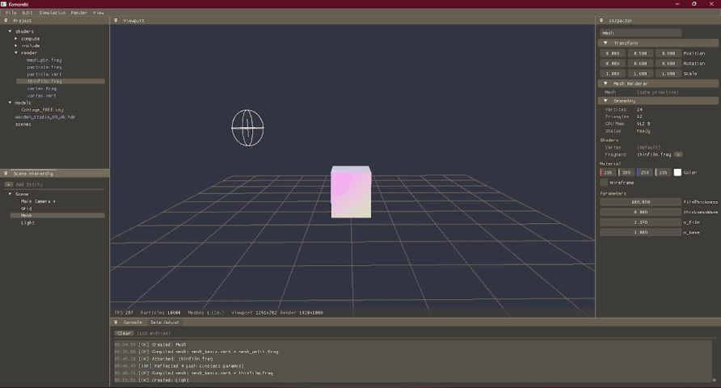
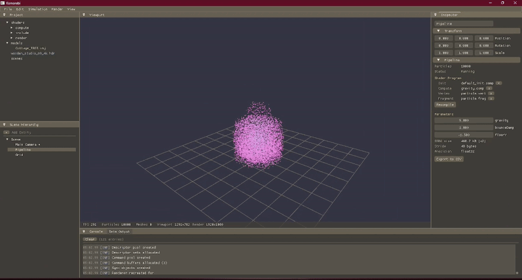
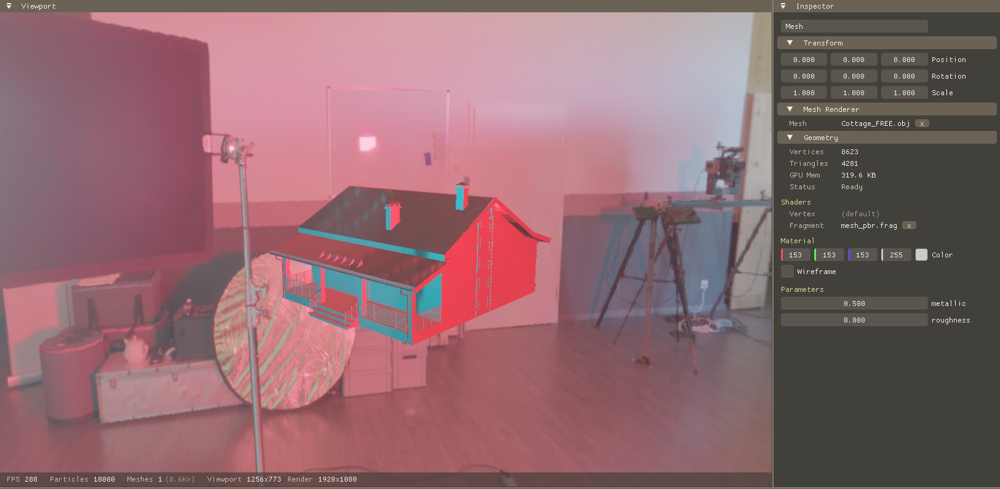

# Komorebi (KMRB)

Komorebi is a real-time 3D rendering and particle simulation editor built from scratch in C++ and Vulkan. Load 3D models, write shaders, and tweak parameters live.

<br/>
<em>3D rendering of thin film interference</em>

<br/>
<em>GPU particle simulation - gravity with bounciness</em>

<br/>
<em>HDR environment map - 0.5 metallic</em>

---

## Features

**Real-time controls, 3D model loading & lighting**

Shader parameters appear automatically as UI sliders. Load any `.fbx`, `.obj`, or `.gltf` model, assign custom shaders, and tweak everything live.

<video src="https://github.com/user-attachments/assets/f5df823d-9ad9-4401-9a95-c101aebb0b96" autoplay loop muted playsinline width="860"></video>
<br/><em>3D model loading & lighting settings</em>

---

**Live shader hot-reload & auto-generated UI**

Edit a shader file and save — the engine recompiles instantly. Add a variable in GLSL and a slider appears in the Inspector automatically, no manual UI wiring needed.

<video src="https://github.com/user-attachments/assets/4b6bb7df-d951-4b4f-9f30-acf61cbc1014" autoplay loop muted playsinline width="860"></video>
<br/><em>Hot reload and auto-generated Inspector controls</em>

---

## Technical highlights

**Built on Vulkan** - the lowest-level GPU API, no abstraction layers or shortcuts.

**Shader reflection** - reads compiled shader bytecode and builds UI controls automatically. Add a variable in GLSL, the slider appears.

**GPU particle simulation** - 10,000+ particles per frame on the GPU via compute shaders, not the CPU.

**Hot-reload** - edit a shader, save it, the engine recompiles and updates in under a second.

**Industry-standard 3D formats** - loads the same `.fbx`, `.obj`, and `.gltf` files used in Unreal Engine and Unity.

**HDR environment maps** - load any `.hdr` file as a scene-wide skybox.

---

## Tech stack


---

<details>
<summary>Build instructions</summary>

### Prerequisites

- Windows 10/11
- [Vulkan SDK](https://vulkan.lunarg.com/) 1.3+ (`VULKAN_SDK` env var must be set)
- [CMake](https://cmake.org/) 3.20+
- [vcpkg](https://github.com/microsoft/vcpkg)
- Visual Studio 2022 or any C++20 MSVC toolchain

### vcpkg dependencies

```
vcpkg install glfw3 glm entt
```

### Build & run

```
git clone https://github.com/finn7199/Komorebi.git
cd Komorebi

cmake -B build -DCMAKE_TOOLCHAIN_FILE=%VCPKG_ROOT%/scripts/buildsystems/vcpkg.cmake
cmake --build build --config Debug
```

```
./build/Debug/Komorebi.exe
```

Or open `build/Komorebi.sln` in Visual Studio and hit F5.

</details>

<details>
<summary>Writing shaders</summary>

New compute shaders can be created from **File > New Compute Shader**. The template includes a push constant block:

```glsl
layout(push_constant) uniform Params {
    mat4 model;       // Engine built-in (do not remove)
    vec4 color;       // Engine built-in (do not remove)

    // Your parameters below — these become Inspector sliders automatically
    float gravity;
    float damping;
} params;
```

`model` and `color` (offsets 0–79) are reserved by the engine. Your parameters go after offset 80, up to 128 bytes total. Any variable you add here will appear as a live slider in the Inspector with no additional code.

</details>
